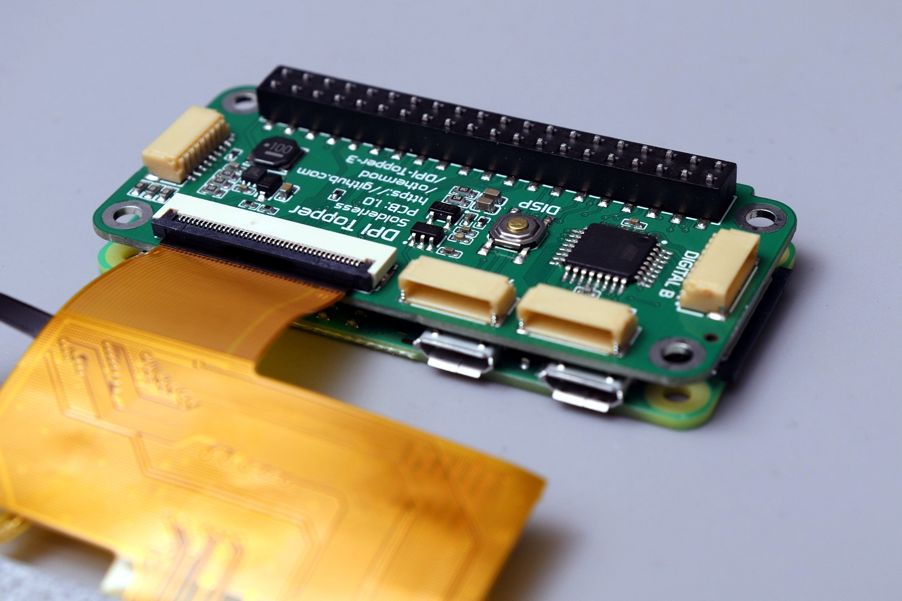

# Raspberry Pi DPI Topper 3

An open-source add-on board for the Raspberry Pi (Zero/3/4/5) that adds display output, brightness control, touchscreen input, analog inputs, digital inputs, and audio.

<table>
  <tr>
    <td></td>
    <td></td>
    <td></td>
    <td></td>
  </tr>
</table>

## Features

- Compatible with [standard 40-pin LCD displays](lcds/) up to 800x480
- 24-bit color display with 8-level brightness control
- I2C capacitive touch panel support
- Up to 5 available GPIOs depending on features enabled
- 16 digital inputs and 4 analog inputs (Gamepad variant only)
- Mono audio output (Gamepad variant only)

## Getting Started

**Visit the [Documentation](docs/README.md) page to learn about features, options, and compatibility**

**Get a Board:**
- [Buy pre-assembled](https://othermod.com) - Available in Basic and Gamepad editions, Solder and Solderless mounting styles
- [Build your own](boards/) - PCB files and assembly instructions

## Community & Support

- [Discord](https://discord.gg/V96c3JC) - Community discussions and support
- [YouTube](https://youtube.com/othermod) - Video tutorials and updates
- [Contact](https://linktr.ee/othermod) - Other ways to reach out

## License

Hardware design: Creative Commons (CC BY-SA) - Attribution required  
Software components: MIT License

You're free to share and adapt the material. Hardware designs require appropriate credit.
