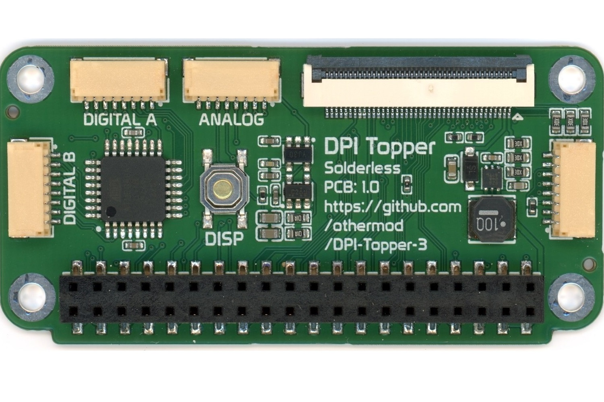
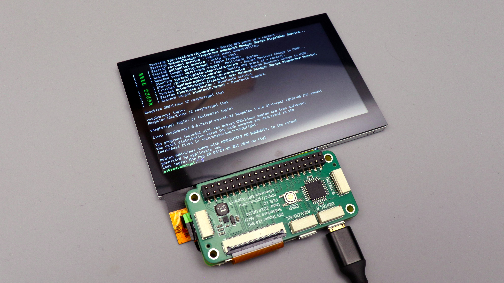
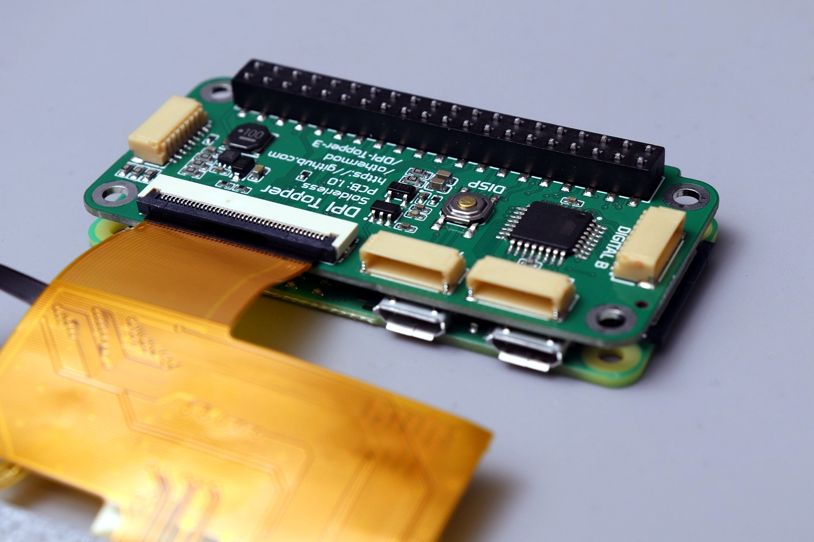
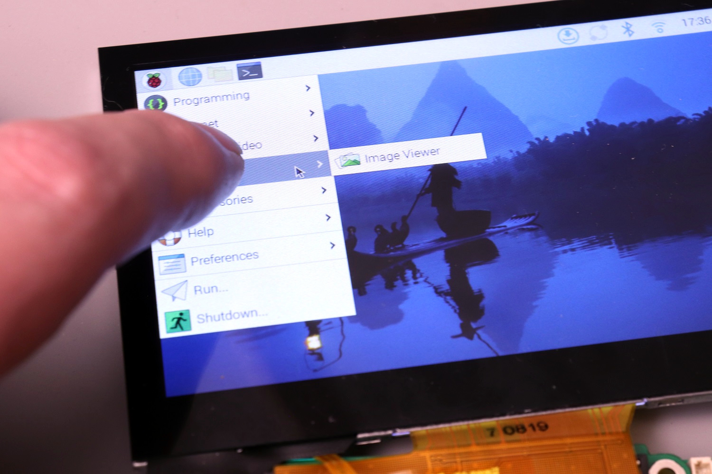

# Raspberry Pi DPI Topper 3

An open-source add-on board for Raspberry Pi (Zero/3/4/5) that adds display output, analog and digital inputs, and audio to a Raspberry Pi. The board sits directly on top of the Raspberry Pi, utilizing its GPIO pins.

<table>
  <tr>
    <td></td>
    <td></td>
    <td></td>
    <td></td>
  </tr>
</table>

## Features

- **Display Support**
  - Compatible with standard 40-pin LCD displays
  - Tested with 4.3" 800x480 display (see datasheets/)
  - Full 24-bit color support
  - Optional 21-bit mode freeing up 3 GPIOs
  - 8-level brightness control via onboard button, external button, and I2C
  - I2C capacitive touch panel support

- **Input Controls**
  - 16 digital inputs (configured as gamepad buttons)
  - 4 analog inputs (configured as dual joysticks)
  - All input data transmitted via I2C

- **Audio Support**
  - Built-in audio circuit when using 21-bit display mode
  - Includes buffering, filtering, and amplification
  - Compatible with headphones, small speakers, or amplifiers
  - NOTE: Audio is not working on the Raspberry Pi 5 because they have not yet written the PWM audio drivers.

## Project Structure

```
├── atmega/          # ATMega firmware and flashing instructions
├── boards/          # PCB Gerber files and Bill of Materials
├── datasheets/      # LCD display documentation
└── rpi/             # Raspberry Pi drivers
    ├── audio/       # Audio configuration
    ├── gamepad/     # Gamepad driver
    ├── lcd/         # LCD display driver
    └── touch/       # Touchscreen support
```

1. Build or obtain the board using files in `boards/`
2. Flash the ATMega firmware following instructions in `atmega/`
3. Install Raspberry Pi drivers following instructions in `rpi/`
4. Configure display mode (24-bit or 21-bit with audio)

For detailed instructions, refer to the README files in each component directory.


## How to Get a Board

1. **Make Your Own**:
   - Download the PCB files and follow the instructions from the `boards/` directory

2. **Buy a Ready-Made Board**:
   - Available soon at [othermod.com](https://othermod.com)

## Project Status

Development is complete and the design is stable. Documentation and guides are continually being improved to help users get the most out of their DPI Topper 3.

## Stay Connected

- [Discord](https://discord.gg/V96c3JC): Join the community for discussions and support
- [YouTube](https://youtube.com/othermod): Video tutorials and updates
- [Contact](https://linktr.ee/othermod): Other ways to reach me

## License

The hardware design is open-source under the Creative Commons (CC BY-SA) license. Software components are under GPL license. You're free to share and adapt the material, as long as you give appropriate credit.

## Author

othermod
