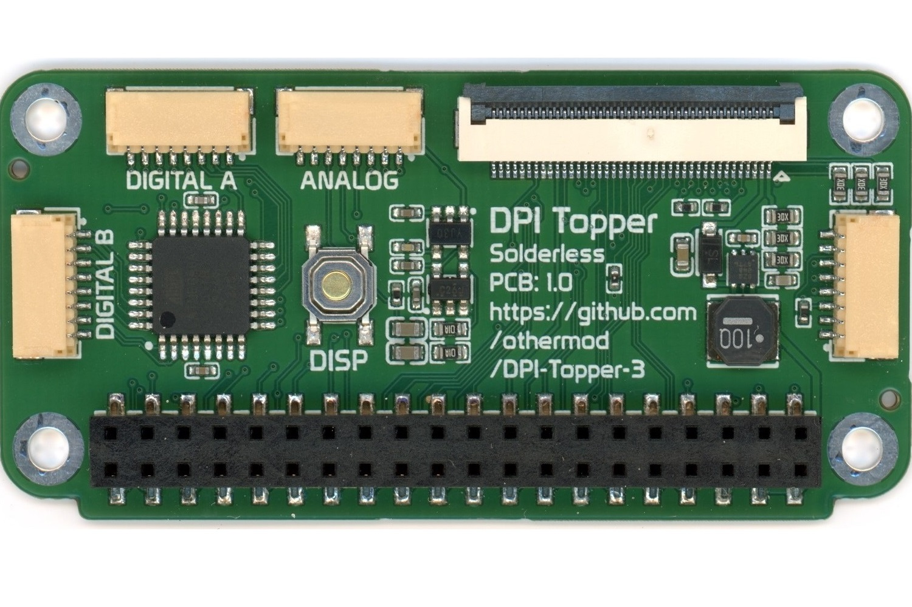
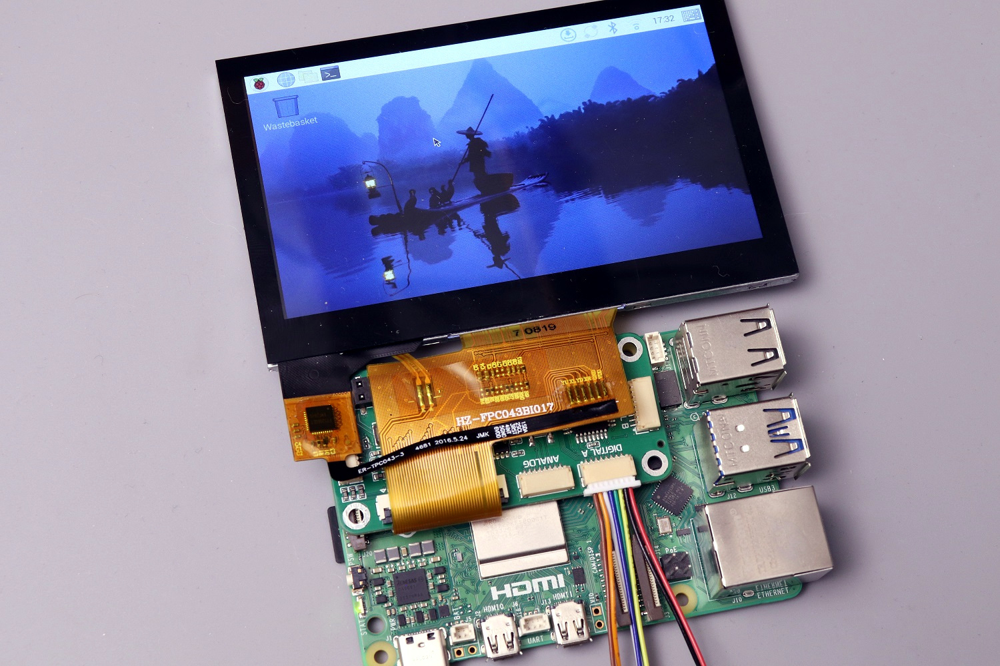
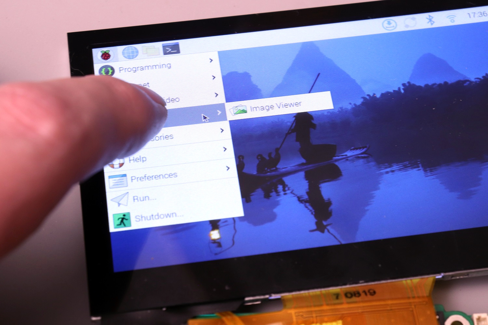

# Raspberry Pi DPI Topper 3

An open-source add-on board for the Raspberry Pi (Zero/3/4/5) that adds display output, touchscreen input, analog and digital inputs, and audio. The board sits directly on top of the Raspberry Pi, utilizing its GPIO pins.

<table>
  <tr>
    <td></td>
    <td></td>
    <td></td>
    <td></td>
  </tr>
</table>

## Features

- **Display Support**
  - Compatible with standard 40-pin LCD displays up to 800x480
  - Full 24-bit color support
  - Optional 21-bit mode freeing up 3 GPIOs
  - 8-level brightness control via onboard button, external button, and I2C
  - I2C capacitive touch panel support

- **Input Controls**
  - 16 digital inputs (configured as gamepad buttons)
  - 4 analog inputs (configured as dual joysticks)
  - All input data transmitted via I2C

- **Audio Support**
  - Built-in mono audio circuit when using 21-bit display mode
  - Includes buffering, filtering, and amplification
  - Compatible with headphones, small speakers, or amplifiers

## Getting Started

**Get a Board:**
- [Buy pre-assembled](https://othermod.com) - Available in Minimal and Full variants
- [Build your own](boards/) - PCB files and assembly instructions

**Documentation:**
- **[Docs](docs/)** - Board variants, Pi compatibility, and setup guides

## Project Structure

```
├── atmega/          # ATMega firmware
├── boards/          # PCB files
├── docs/            # Documentation
├── lcds/            # LCD display documentation
└── rpi/             # Raspberry Pi drivers
    ├── audio/       # Audio configuration
    ├── backlight/   # Backlight control utility
    ├── display/     # LCD display overlay
    ├── gamepad/     # Gamepad driver
    └── touch/       # Touchscreen overlay
```

## Community & Support

- [Discord](https://discord.gg/V96c3JC) - Community discussions and support
- [YouTube](https://youtube.com/othermod) - Video tutorials and updates
- [Contact](https://linktr.ee/othermod) - Other ways to reach out

## License

Hardware design: Creative Commons (CC BY-SA) - Attribution required  
Software components: MIT License

You're free to share and adapt the material. Hardware designs require appropriate credit.
