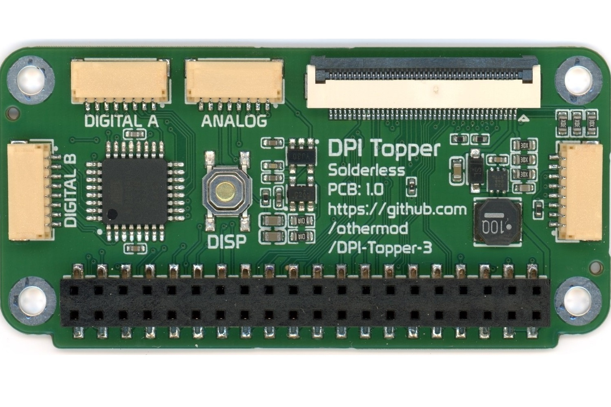
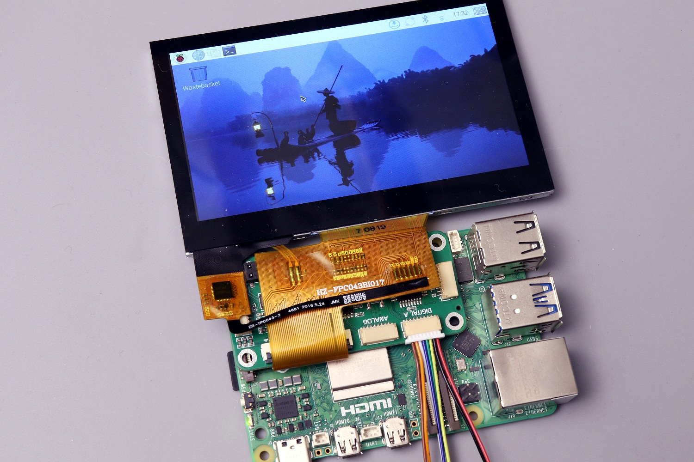
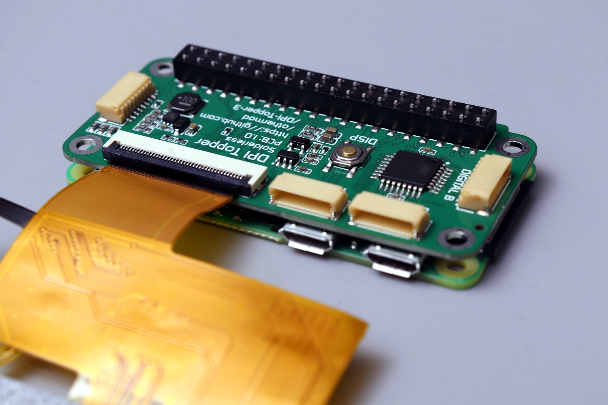
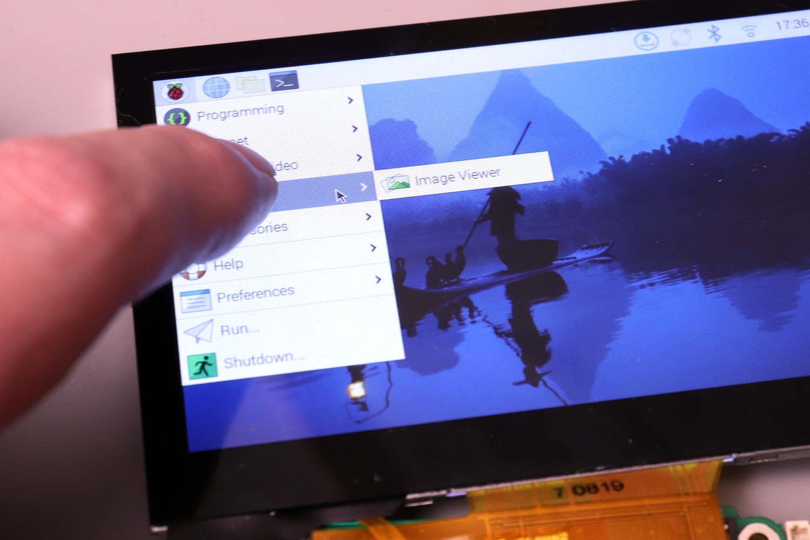

# Raspberry Pi DPI Topper 3

An open-source add-on board for the Raspberry Pi (Zero/3/4/5) that adds display output, brightness control, touchscreen input, analog inputs, configurable GPIO (inputs/outputs), and audio. Suitable for gaming devices, control panels, information displays, IoT dashboards, and custom HMI applications.

<table>
  <tr>
    <td></td>
    <td></td>
    <td></td>
    <td></td>
  </tr>
</table>

## Features

- Compatible with standard 40-pin LCD displays up to 800x480
- 24-bit color display with brightness control
- I2C capacitive touch panel support
- Up to 5 available GPIOs (depending on features enabled)
- 16 digital inputs/outputs and 4 analog inputs (Gamepad variant only)
- Mono audio output (Gamepad variant only)

## Getting Started

Visit the [Topper 3 Wiki](https://github.com/othermod/DPI-Topper-3/wiki) to learn about features, options, and compatibility

**Get a Board:**
- [Buy pre-assembled](https://othermod.com)
- [Build your own](boards/)

## Community & Support

- [Discord](https://discord.gg/V96c3JC) - Community discussions and support
- [YouTube](https://youtube.com/othermod) - Video tutorials and updates
- [Contact](https://linktr.ee/othermod) - Other ways to reach out or support the project

## License

Hardware: Creative Commons (CC BY-SA)  
Software: MIT License
