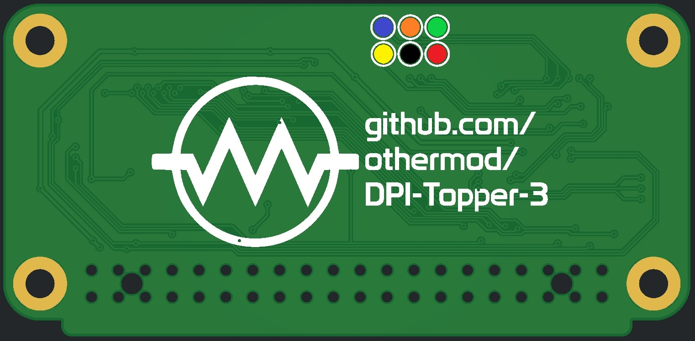
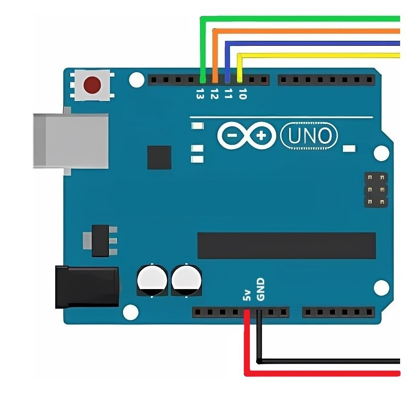

This guide provides step-by-step instructions for flashing the necessary firmware and fuses to the ATmega8A microcontroller on the Topper board, using either a Raspberry Pi or an Arduino.

**Note:** If you order a board from othermod.com, you don't have to flash firmware. I flash the firmware on every board before shipping. This is only required if you are manufacturing your own board or are updating the firmware.

## Table of Contents
1. [Connection](#connection)
2. [Firmware and Fuses](#firmware-and-fuses)
3. [Flashing with Raspberry Pi](#flashing-with-raspberry-pi)
4. [Flashing with Arduino](#flashing-with-arduino)
5. [Creating Custom Firmware](#creating-custom-firmware)

## Connection

Before flashing the firmware, you need to wire a connection with the ATmega8A chip on your Topper board. You can either solder wires directly to the board or use a pogo pin rig for a non-permanent connection.



Regardless of your chosen method, you'll need to connect to these points on the Topper board (colors will stay consistent throughout the guide):
- 🔴 VCC
- ⚫ GND
- 🟢 Clock
- 🟠 MISO
- 🔵 MOSI
- 🟡 Reset

## Firmware and Fuses

You can flash firmware using either a Raspberry Pi or an Arduino. Each method is described below.

## Flashing with Raspberry Pi

#### Wiring

Before you begin the flashing process, you need to connect the Topper board to your Raspberry Pi. Here's how to make the connections:


- 🔴 Connect VCC to Raspberry Pi 3.3V (Pin 1 or 17)
- ⚫ Connect GND to any Raspberry Pi GND pin (e.g., Pin 6)
- 🟢 Connect Clock to Raspberry Pi GPIO3
- 🟠 Connect MISO to Raspberry Pi GPIO6
- 🔵 Connect MOSI to Raspberry Pi GPIO5
- 🟡 Connect Reset to Raspberry Pi GPIO2

Ensure all connections are secure and not bridged before proceeding with the flashing process.

#### Configuring avrdude

1. Install avrdude if you haven't already:
   ```
   sudo apt-get update
   sudo apt-get install avrdude
   ```

2. Edit the avrdude configuration file:
   ```
   sudo nano /etc/avrdude.conf
   ```

3. Find the `linuxgpio` entry (use Ctrl+W to search) and modify it to:
   ```
   programmer
     id    = "linuxgpio";
     desc  = "Use the Linux sysfs interface to bitbang GPIO lines";
     type  = "linuxgpio";
     reset = 2;
     sck   = 3;
     mosi  = 5;
     miso  = 6;
   ;
   ```
   The entry may be commented out by default, so remove the # from the beginning of each line.

#### Flashing
1. Copy the [firmware file](atmega.ino.arduino_standard.hex) to your Raspberry Pi.

2. Flash the fuses:
   ```
   sudo avrdude -p m8 -c linuxgpio -U lfuse:w:0xE4:m -U hfuse:w:0xDC:m
   ```

3. Flash the firmware:
   ```
   sudo avrdude -p m8 -c linuxgpio -e -U flash:w:atmega.ino.arduino_standard.hex
   ```

After successful flashing, disconnect the wires from your Raspberry Pi. The Topper board is ready to use.

## Flashing with Arduino

The process for flashing with Arduino is similar to the Raspberry Pi method.

**Warning:** Ensure that an LCD is NOT connected to the Topper when flashing the firmware using an Arduino.

#### Connecting to the Arduino



Here's how to make the connections:

1. Arduino to Topper connections:
   - 🔴 Connect VCC to Arduino 5V
   - ⚫ Connect GND to Arduino GND
   - 🟢 Connect Clock to Arduino Pin 13 (Clock)
   - 🟠 Connect MISO Arduino Pin 12 (MISO)
   - 🔵 Connect MOSI Arduino Pin 11 (MOSI)
   - 🟡 Connect Reset Arduino Pin 10 (Reset)


#### Modifying boards.txt configuration

Before flashing the firmware using Arduino, you need to modify the boards.txt file to add support for the ATmega8A:

1. Locate your Arduino IDE installation directory.
2. Navigate to the `C:\Program Files (x86)\Arduino\hardware\arduino\avr` directory.
3. Open the `boards.txt` file in a text editor.
4. Add the following lines at the end of the file:

```
atmega8a_nb.name=ATmega8A (8MHz Internal, No bootloader)
atmega8a_nb.upload.tool=avrdude
atmega8a_nb.upload.protocol=arduino
atmega8a_nb.upload.maximum_size=8192
atmega8a_nb.upload.maximum_data_size=1024
atmega8a_nb.bootloader.tool=avrdude
atmega8a_nb.bootloader.low_fuses=0xE4
atmega8a_nb.bootloader.high_fuses=0xDC
atmega8a_nb.bootloader.unlock_bits=0x3F
atmega8a_nb.bootloader.lock_bits=0x0F
atmega8a_nb.bootloader.file=empty.hex
atmega8a_nb.build.mcu=atmega8a
atmega8a_nb.build.f_cpu=8000000L
atmega8a_nb.build.core=arduino:arduino
atmega8a_nb.build.variant=arduino:standard
atmega8a_nb.build.board=atmega8a
atmega8a_nb.recipe.size.regex=^(?:\.text|\.data|\.bootloader)\s+([0-9]+).*
atmega8a_nb.recipe.size.regex.data=^(?:\.data|\.bss)\s+([0-9]+).*
atmega8a_nb.recipe.size.regex.eeprom=^\.eeprom\s+([0-9]+).*
```

5. Save the file and restart the Arduino IDE.

#### Setting Up Arduino as ISP

This configures the Arduino as a connection point between the PC and the microcontroller on the Topper.

1. In Arduino IDE, go to File > Examples > 11.ArduinoISP > ArduinoISP.
2. Select Tools > Board > Arduino Uno.
3. Select Tools > Programmer > AVRISP MKII.
4. Upload the sketch to your Arduino.

#### Flashing

1. Select Tools > Board > ATmega8A (8MHz Internal, No bootloader).
2. Select Tools > Programmer > Arduino as ISP.
3. To flash the fuses:
   - Go to Tools > Burn Bootloader.
4. To flash the firmware:
   - Go to Sketch > Upload Using Programmer.

**Note:** You will see an error regarding a missing empty.hex file when flashing the fuses. It doesn't affect the process, but if you want to eliminate the error, copy [empty.hex](empty.hex) to `C:\Program Files (x86)\Arduino\hardware\arduino\avr\bootloaders`.

After successful flashing, disconnect all wires from the Arduino. The Topper board is now ready to use.

## Creating Custom Firmware

If you want to create your own custom firmware for the ATmega8A, you'll need to follow the same steps for modifying the boards.txt file as described in the [Modifying boards.txt configuration](#modifying-boardstxt-configuration) section above. After configuring the Arduino IDE, you can develop your custom firmware, compile it, and then flash it to the ATmega8A using the same steps outlined in the Flashing sections.
