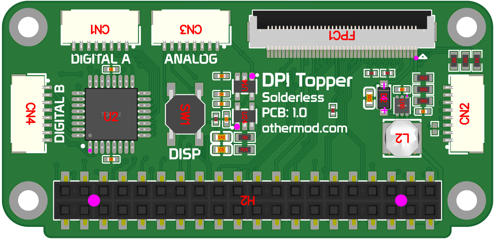

## PCB 1.0 Changes
- Initial release

## Known Issues
- No known bugs at this time

## Board Variants

The board is available in two variants: Minimal and Full. Both use the same Gerber files but differ in which components are populated.

<table>
  <tr>
    <td align=center>Minimal PCB</td>
    <td align=center>Full PCB</td>
  </tr>
  <tr>
    <td></td>
    <td></td>
  </tr>
  <tr>
    <td>The Minimal PCB variant is the lower-cost option. It includes only the necessary parts to get the following: 
    - Display output 
    - Touch panel support 
    - Manual backlight control 
    - 3 extra GPIOs (when using the board in 21-bit mode)</td>
    <td>The Full PCB has all the features of the Minimal PCB, and adds the following features: 
    - Audio output 
    - Analog inputs 
    - Digital inputs 
    - 8-level brightness control using the onboard or external button</td>
  </tr>
</table>
