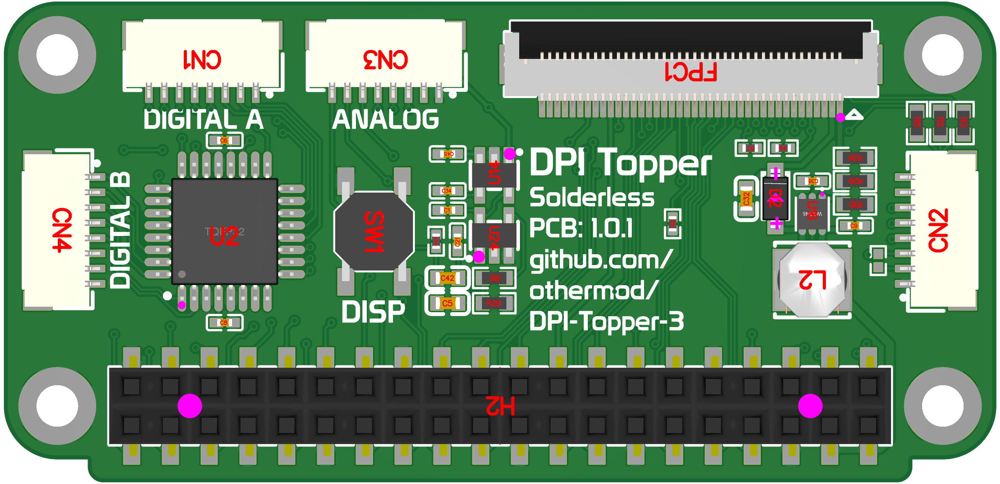
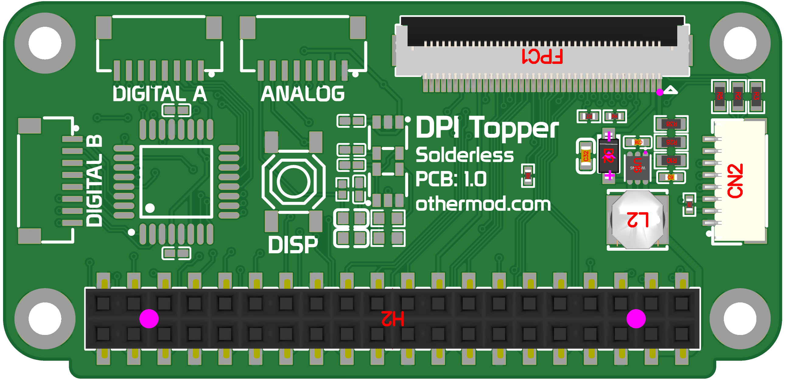
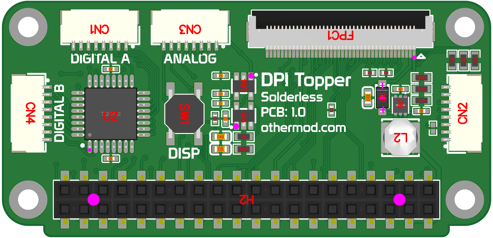

# Boards

## Buy a Ready‑Made Board  
Pre‑assembled boards will be available soon at [othermod.com](https://othermod.com).

---

## Make Your Own  

### Download Files  
1. Navigate to the newest PCB folder (currently `1.0.1`).  
2. Download the Gerber files from the `pcb` subfolder.  
3. For assembly:  
   * Bill of Materials (BOM) is in the `bom` subfolder.  
   * Pick‑and‑Place file is in the `pnp` subfolder.

### Manufacturing Recommendations  
- I use [JLCPCB](https://jlcpcb.com/?from=othermod) for all the boards I sell. Feel free to use my link if you want to try them out.  
  *Note: I have an affiliate agreement with JLCPCB and receive referral credit for purchases.*  
- Board thickness: **1 mm** recommended (but not mandatory).  
- Standard FR‑4 material is suitable.

---

## Board Layout  

---

## Project Files  

* [EasyEDA Project](https://oshwlab.com/adamseamster/dpi-topper-3-shared) – online editor with the latest designs.  
* Board and schematic JSON files are included in each version’s `pcb` folder for importing into EasyEDA.  
* Gerber files are provided for direct manufacturing.

---

## Board Variants  

The board is available in two variants: **Minimal** (lower‑cost, essential features) and **Full** (all optional features). Both use the same Gerber files but differ only in component placement.

<table>
  <tr>
    <td align="center">Minimal PCB</td>
    <td align="center">Full PCB</td>
  </tr>
  <tr>
    <td></td>
    <td></td>
  </tr>
  <tr>
    <td>The Minimal PCB variant is the lower‑cost option. It includes only the necessary parts to get the following: - Display output - Touch panel support - Manual backlight control - 3 extra GPIOs (when using the board in 21‑bit mode)</td>
    <td>The Full PCB has all the features of the Minimal PCB, and adds the following features: - Audio output - Analog inputs - Digital inputs - 8‑level brightness control via onboard button, external button, and I²C</td>
  </tr>
</table>

---

## Version History  

### PCB 1.0 – March 7, 2025  
- Initial release.  
- Includes the two variants described above.

### PCB 1.1 – March 21, 2025  
- Added website link to top of board documentation page.  
- No known bugs.
