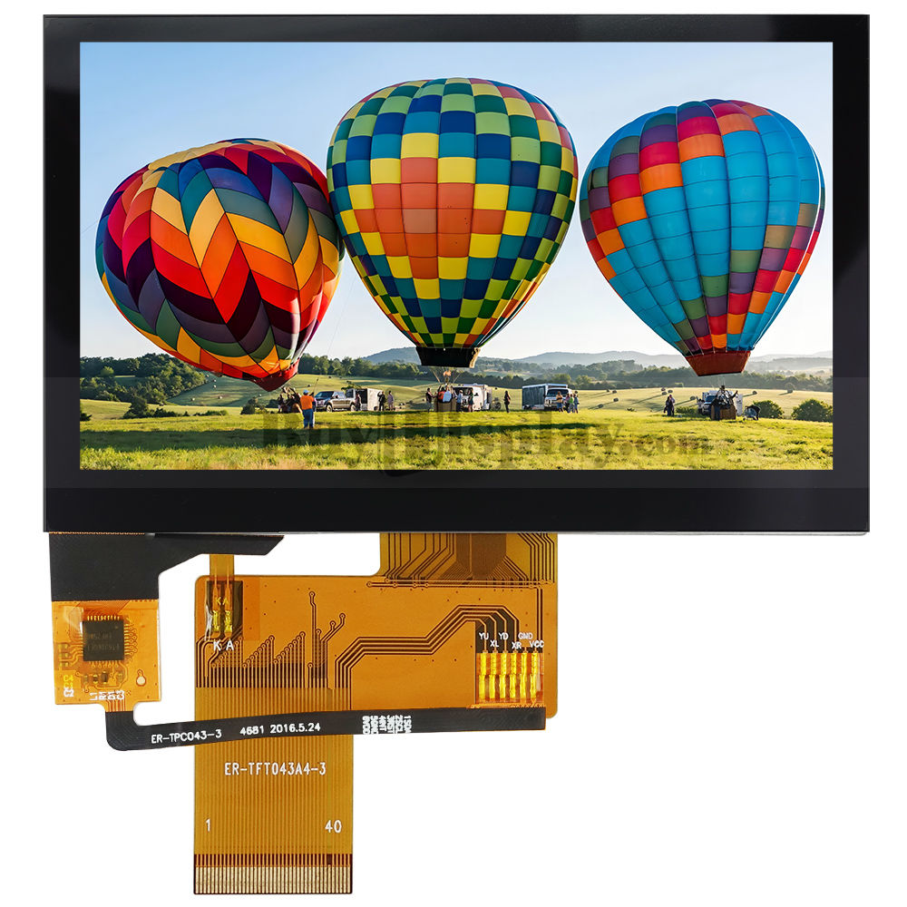
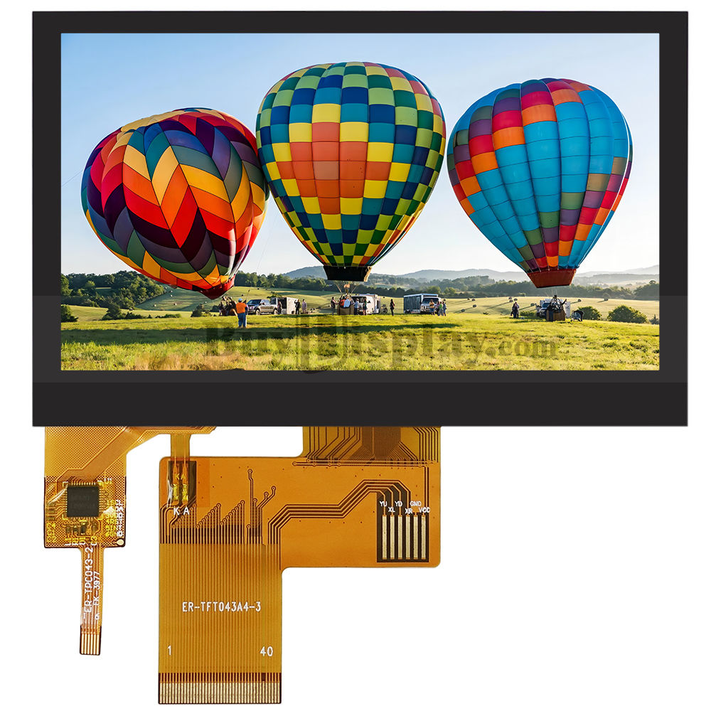

# Choosing an LCD

## Verified Compatible Displays

- [ER-TFT043A1-7](ER-TFT043A1-7.md) - 4.3" 800x480 IPS (same one used in the PSPi 6 project)
- [ER-TFT050-6](ER-TFT050-6.md) - 5.0" 800x480 IPS

---

## Compatible Touch Panels

The Topper is designed for I2C capacitive touch panels that are routed to the 40-pin FPC cable. Panels that use a separate smaller FPC cable are compatible but require a [separate FPC breakout board](https://amzn.to/4sFc5fM). It is not compatible with resistive touch panels.

<table>
<tr>
  <td align="center"><h4>✅ CAPACITIVE TOUCH PANEL</h4></td>
  <td align="center"><h4>⚠️ FPC TOUCH PANEL</h4></td>
  <td align="center"><h4>❌ RESISTIVE TOUCH PANEL</h4></td>
</tr>
  <tr>
    <td></td>
    <td></td>
    <td></td>
  </tr>
</table>

---

## 40-pin FPC Connector Pinout (0.5mm pitch)

| Pin | Name | Description |
|-----|------|-------------|
| 1 | VLED- | LED Cathode |
| 2 | VLED+ | LED Anode |
| 3 | GND | Ground |
| 4 | VDD | Power Supply (3.3V) |
| 5-12 | R0~R7 | Red Data |
| 13-20 | G0~G7 | Green Data |
| 21-28 | B0~B7 | Blue Data |
| 29 | GND | Ground |
| 30 | PCLK | Clock |
| 31 | DISP | Display On/Off |
| 32 | HSYNC | Horizontal Sync (or GND if unused) |
| 33 | VSYNC | Vertical Sync (or GND if unused) |
| 34 | DE | Data Enable |
| 35 | NC | Not Connected |
| 36 | GND | Ground |
| 37 | XR/INT | Resistive touch output / Capacitive touch interrupt |
| 38 | YD/RST | Resistive touch output / Capacitive touch reset |
| 39 | XL/SCL | Resistive touch output / Capacitive touch SCL (I²C) |
| 40 | YU/SDA | Resistive touch output / Capacitive touch SDA (I²C) |
